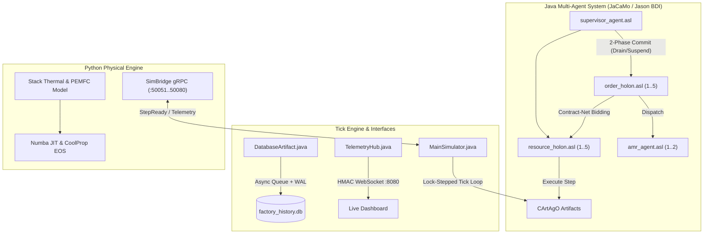

# Matrix Factory Twin

[](https://github.com/utczbr/Matrix_Factory/actions)
[](https://www.python.org/)
[](https://www.oracle.com/java/)
[](LICENSE)
[](#visual-architecture--system-flow)

**An event-driven, hybrid multi-agent digital twin framework for modular hydrogen fuel-cell manufacturing, coupling BDI agent cognitive reasoning in Java with first-principles electrochemical physics in Python via a lock-stepped gRPC simulation bridge.**

---

## Visual Architecture & System Flow



---

## Key Features

* **Hybrid BDI & First-Principles Physics**: Combines Jason/CArtAgO agent cognitive reasoning in Java 17 with Numba-accelerated PEMFC fuel cell electrochemistry and thermal dynamic models in Python.
* **Dynamic Control Schema Transitions**: Real-time Two-Phase Commit (Phase 0 Drain, Phase 1 Suspend) switching between PROSA (peer-negotiated) and ADACOR (hierarchical) upon energy price spikes.
* **Deterministic Lock-Stepped Simulator (TMC)**: Replaces non-deterministic wall-clock sleeps (`Thread.sleep`) with a synchronous Next Event Request (NER) engine in `MainSimulator.java`.
* **Single-JVM Fan-Out Monte Carlo Scale**: Orchestrates up to 30 parallel, fully isolated simulation runs inside a single JVM instance via source-level agent namespace rewriting.
* **Manufacturing-Quality Bridge**: Propagates upstream assembly defects (S1–S4) directly into downstream electrochemical penalties (+0.08 $\Omega\cdot\text{cm}^2$ internal resistance per defect) during Station 5 polarization sweeps.
* **Configurable gRPC Security & Async Telemetry**: Optional mutual TLS (mTLS) authentication between Java clients and Python daemons, paired with authenticated HMAC-signed WebSocket streaming (`ws://127.0.0.1:8080/telemetry`).

---

## Quick Start / Installation

### Prerequisites
Make sure your system meets the following version requirements:
* **Java Development Kit (JDK)** $\ge$ 17.0.0
* **Python** $\ge$ 3.11.0
* **Gradle** $\ge$ 8.7.0 (or use included `./gradlew` wrapper)
* **OpenSSL** (optional, for mTLS certificate generation)

### Setup in Under 2 Minutes

```bash
# 1. Clone the repository
git clone https://github.com/utczbr/Matrix_Factory.git
cd Matrix_Factory

# 2. Set up environment variables
cp .env.example .env

# 3. Create and activate Python virtual environment
python3 -m venv .venv
source .venv/bin/activate
pip install -r requirements.txt

# 4. Build Java multi-agent components
./gradlew build
```

---

## Usage & Code Examples

### 1. Running a Single Interactive Simulation
Start the Python physical daemon, then launch the Java MAS engine:

```bash
# Terminal 1: Launch Python physical engine daemon on port 50051
.venv/bin/python3 -m physical_engine.sim_bridge_server --port=50051 --run-id=0

# Terminal 2: Launch Java Multi-Agent System (1000 ticks)
./gradlew run --args="0 50051 --max-ticks=1000"
```

### 2. Running a Monte Carlo Experiment (PROSA vs. ADACOR)
Execute a 15-replication Monte Carlo experiment comparing the PROSA baseline against ADACOR dynamic schema switching under energy price disturbances:

```bash
# Runs 15 PROSA + 15 ADACOR simulations and outputs analysis/results.csv
python3 experiments/run_prosa_vs_adacor.py
```

### 3. Statistical Analysis & Report Generation
Compute 95% bootstrap confidence intervals, Shapiro-Wilk normality tests, and Mann-Whitney U significance metrics from experiment results:

```bash
python3 experiments/analyze_results.py analysis/results.csv
```

### 4. Running in Secure Mode (TLS / mTLS)
Enable production-grade Mutual TLS authentication between Java artifacts and Python daemons:

```bash
# 1. Generate local 2048-bit RSA certificates
bash scripts/generate_certs.sh certs/

# 2. Start Python server in secure mode
GRPC_SECURE_MODE=true .venv/bin/python3 -m physical_engine.sim_bridge_server --port=50051 --run-id=0

# 3. Start Java MAS in secure mode
GRPC_SECURE_MODE=true ./gradlew run --args="0 50051 --max-ticks=1000"
```

### 5. Running Test Suites

```bash
# Run Python unit & security tests (43 tests)
.venv/bin/pytest

# Run Java MAS integration test suite
./gradlew test
```

---

## Tech Stack & Prerequisites

| Layer | Technologies & Frameworks | Minimum Version | Purpose |
| :--- | :--- | :--- | :--- |
| **Multi-Agent System (MAS)** | Java, JaCaMo (Jason BDI, CArtAgO, MoISE), Gradle | Java 17+, Gradle 8.7+ | BDI agent reasoning, organizational roles, and Contract-Net negotiations. |
| **Physical Engine** | Python, gRPC / Protobuf, Numba, NumPy, SciPy, CoolProp | Python 3.11+ | First-principles PEMFC electrochemistry, thermal models, and JIT sweeps. |
| **Security & Interfaces** | OpenSSL TLS/mTLS, Tyrus WebSocket, HMAC SHA-256 | OpenSSL 1.1+ | Encrypted gRPC daemon channels and authenticated browser telemetry. |
| **Persistence** | SQLite JDBC (WAL mode), `ArrayBlockingQueue` | SQLite 3+ | Thread-safe, lock-free historic event and process variation logging. |
| **Analysis & Reporting** | Pandas, SciPy (`shapiro`, `mannwhitneyu`), LaTeX | Python 3.11+ | Statistical hypothesis testing, confidence interval extraction, and manuscript builds. |

---

## Contributing & License

Contributions are welcome! Please feel free to open Issues or submit Pull Requests for bug fixes, physical model expansions, and algorithmic improvements.

### License
This project is open-source software licensed under the **[MIT License](LICENSE)**.
