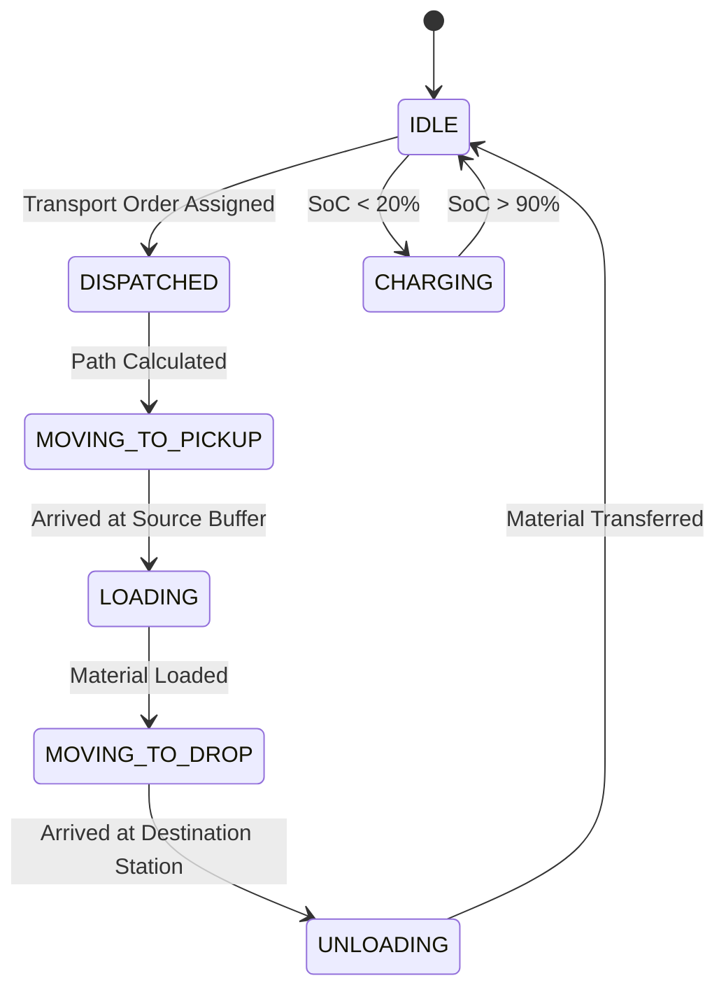

# AMR Fleet Agents & Logistics (Reference)

This document describes the dispatch, path routing, battery state-of-charge (SoC) modeling, and material movement logic of **Autonomous Mobile Robot (AMR)** fleet agents (`amr_agent.asl`).

---

## Agent Role & Transport Logistics

AMR Fleet Agents handle intralogistics transport of in-process MEAs, bipolar plate stacks, and finished fuel cell units between buffer storage racks and station processing cells (Stations 1 $\rightarrow$ 5).

---

## State Machine & Motion Dynamics

---

## Battery State of Charge (SoC) Derating Model

Battery depletion during transport depends on payload mass $m_{\mathrm{load}}$ ($\mathrm{kg}$) and travel distance $d$ ($\mathrm{m}$):

$$\mathrm{SoC}_{t+1} = \mathrm{SoC}_t - \frac{\left( P_{\mathrm{idle}} + \mu_{\mathrm{roll}} (m_{\mathrm{robot}} + m_{\mathrm{load}}) g v_{\mathrm{amr}} \right) \cdot \Delta t}{E_{\mathrm{battery,max}}}$$

where:
* $m_{\mathrm{robot}} = 120\mathrm{kg}$.
* $v_{\mathrm{amr}} = 1.5\mathrm{m/s}$.
* $\mu_{\mathrm{roll}} = 0.015$ (rubber wheel on industrial epoxy floor).
* $E_{\mathrm{battery,max}} = 1.20\mathrm{kWh}$.

---

## Code Reference

* Agent Source File: [`src/agt/amr_agent.asl`](https://github.com/utczbr/Matrix_Factory/blob/main/src/agt/amr_agent.asl)
