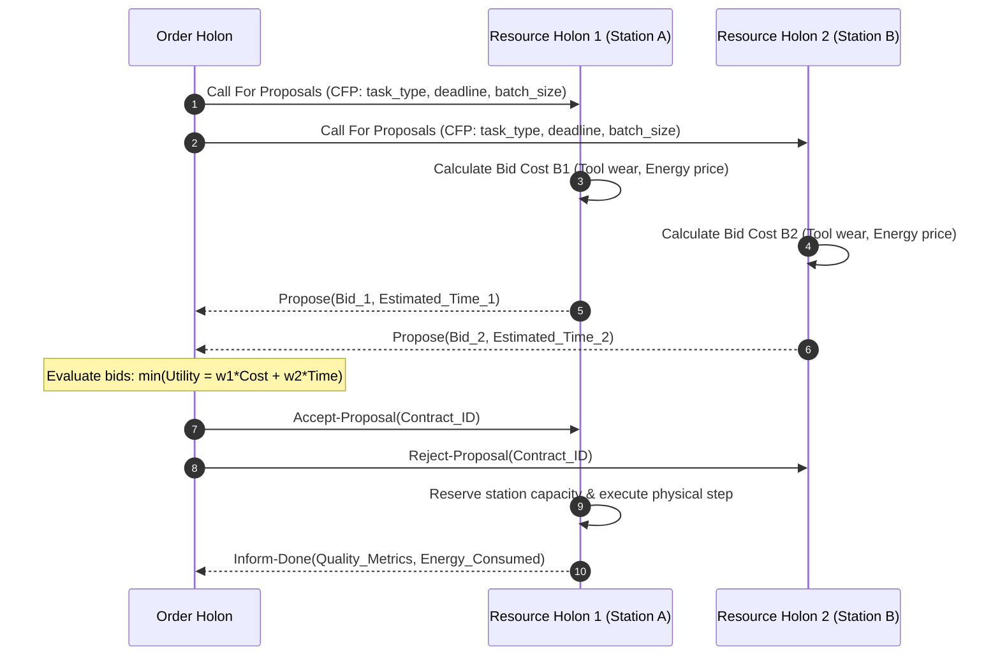

# Order & Resource Holons — Contract-Net Bidding (Reference)

This document describes the holonic interaction patterns between **Order Holons** and **Resource Holons**, detailing the **Contract-Net Protocol** and bidding utility evaluation formulas.

---

## Holonic Roles & Responsibilities

1. **Order Holons (`order_holon.asl`):** Represent individual MEA/stack production batches. Responsible for negotiating task execution across manufacturing stations to minimize total completion time and energy cost.
2. **Resource Holons (`resource_holon.asl`):** Represent physical station machinery (Stations 1–5). Maintain local tool wear indicators, thermal states, and calculate cost bids.

---

## Contract-Net Bidding Sequence Flow

---

## Bidding Utility Function

When receiving a Call for Proposals (CFP), a Resource Holon evaluates its bid cost $B_{\text{res}}$ using:

$$B_{\text{res}} = w_e \cdot E_{\text{est}} \cdot P_{\text{grid}} + w_w \cdot D_{\text{wear}} + w_q \cdot (1 - Q_{\text{historical}})$$

where:
* $E_{\text{est}}$ is estimated energy consumption ($\text{kWh}$).
* $P_{\text{grid}}$ is current spot market energy price ($\$/\text{kWh}$).
* $D_{\text{wear}}$ is incremental tool wear or fracture risk (e.g., Archard wear or $C_{\text{crit,NCL}}$ from Station 3).
* $Q_{\text{historical}}$ is historical station quality metric yield $\in [0, 1]$.
* $w_e, w_w, w_q$ are weighting coefficients dynamically adjusted based on control topology (PROSA vs. ADACOR).

---

## Code Reference

* Order Holon: [`src/agt/order_holon.asl`](file:///home/stuart/Documentos/matrix_factory_twin/src/agt/order_holon.asl)
* Resource Holon: [`src/agt/resource_holon.asl`](file:///home/stuart/Documentos/matrix_factory_twin/src/agt/resource_holon.asl)
