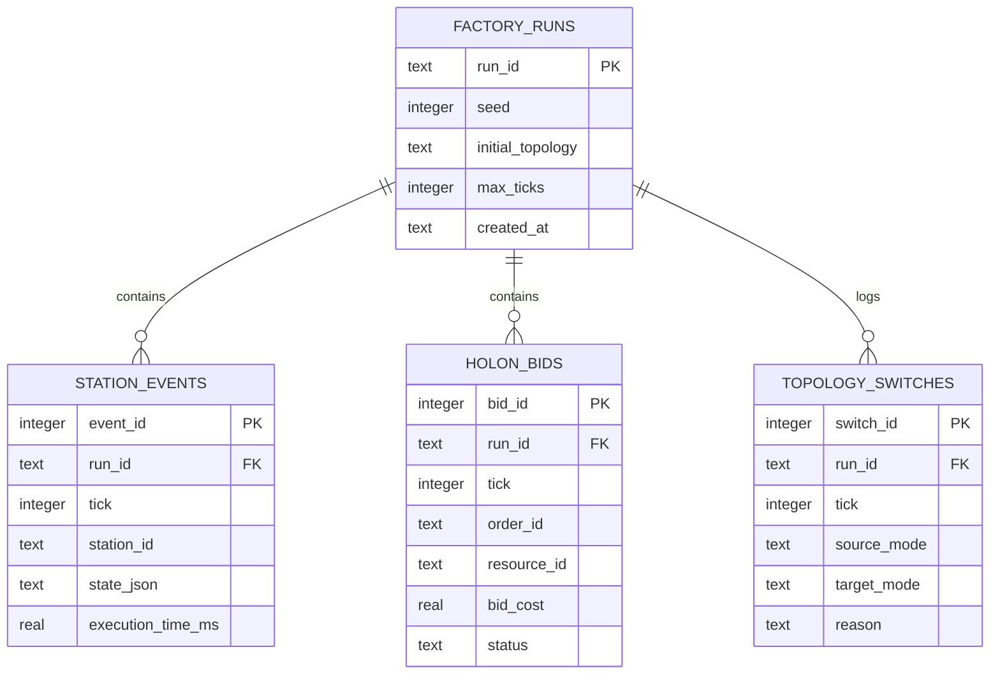
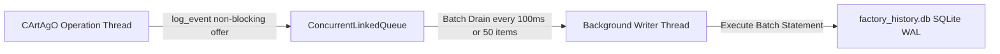

# Database Schema & Asynchronous Queue (Reference)

This document presents the relational database schema, SQLite Write-Ahead Logging (WAL) configuration, and non-blocking asynchronous writer queue implemented in `DatabaseArtifact.java`.

---

## SQLite WAL Mode & Performance Tuning

Matrix Factory Twin utilizes SQLite with Write-Ahead Logging (`WAL`) mode:

```sql
PRAGMA journal_mode = WAL;
PRAGMA synchronous = NORMAL;
PRAGMA temp_store = MEMORY;
PRAGMA mmap_size = 30000000000;
```

This configuration permits non-blocking concurrent reads while `DatabaseArtifact.java` flushes telemetry and bidding logs asynchronously.

---

## Entity-Relationship Schema



---

## Asynchronous Batch Queue Architecture

To prevent disk I/O bottlenecks from stalling the agent execution loop, `DatabaseArtifact.java` utilizes a `BlockingQueue<LogEntry>` with a dedicated background consumer thread:


