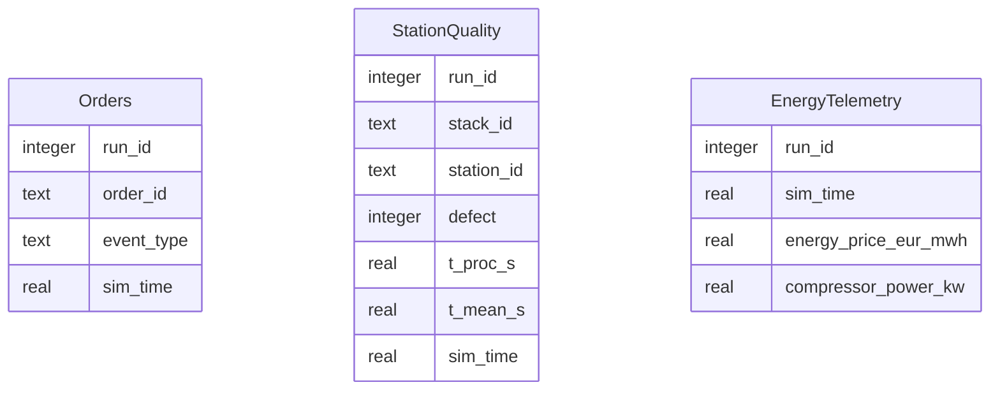
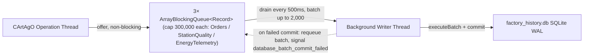

# Database Schema & Asynchronous Queue (Reference)

This document presents the relational database schema, SQLite Write-Ahead Logging (WAL) configuration, and non-blocking asynchronous writer queue implemented in `DatabaseArtifact.java`.

---

## SQLite WAL Mode & Performance Tuning

Matrix Factory Twin utilizes SQLite with Write-Ahead Logging (`WAL`) mode:

```sql
PRAGMA journal_mode = WAL;
PRAGMA wal_autocheckpoint = 100;
PRAGMA synchronous = NORMAL;
```

This configuration permits non-blocking concurrent reads while `DatabaseArtifact.java` flushes telemetry and quality logs asynchronously.

---

## Entity-Relationship Schema



> **Not implemented note:** Bid-logging and topology-switch-logging tables (previously documented as `HOLON_BIDS` and `TOPOLOGY_SWITCHES`) are not implemented in `DatabaseArtifact.java`. Bid tenders and 2PC regime transitions occur dynamically in agent memory (`supervisor_agent.asl` and `order_holon.asl`) but are not persisted to SQLite.

---

## Asynchronous Batch Queue Architecture

To prevent disk I/O bottlenecks from stalling the agent execution loop, `DatabaseArtifact.java` utilizes three dedicated `ArrayBlockingQueue` buffers (capacity 300,000 records each: `queue`, `qualityQueue`, `energyQueue`) serviced by a background drain thread (`drainLoop()`):



