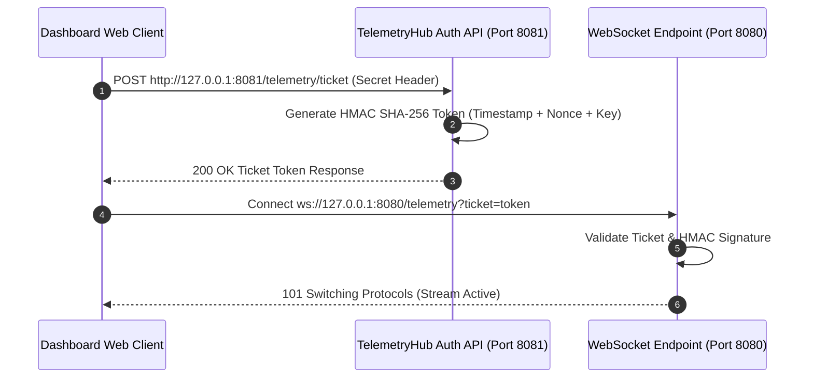

# WebSocket TelemetryHub & HMAC Security (Reference)

This document describes the real-time telemetry streaming service (`TelemetryHub.java`), WebSocket endpoints, JSON event payload structures, and HMAC SHA-256 client authentication flows.

---

## Authentication Ticket Flow

To connect to the live WebSocket telemetry stream (`ws://127.0.0.1:8080/telemetry`), dashboard clients first request an authenticated ticket token from the HTTP ticket server on port 8081:



---

## WebSocket Binary Telemetry Payload Schema

Telemetry is streamed as **binary Protobuf** frames (`TelemetryFrame`, defined in `sim_bridge.proto`), not JSON, at a target rate of ~18 Hz (`TelemetryArtifact.PUBLISH_INTERVAL_S = 1.0 / 18.0`). Each WebSocket binary message contains one serialized `TelemetryFrame`:

```protobuf
message TelemetryFrame {
  uint64 sequence_number             = 1;
  double sim_time_s                  = 2;
  int32  schema_epoch                = 3;
  string active_org_schema           = 4;

  repeated AMRState     amr_states     = 5;
  repeated StationState station_states = 6;
  repeated double thermo_state_vector  = 7 [packed = true];

  double station5_stack_voltage_v       = 8;
  double station5_current_density_a_cm2 = 9;
  double station5_stack_temp_k          = 10;
  double station5_stack_core_temp_k     = 11;
  double station5_stack_skin_temp_k     = 12;
  uint32 station5_failure_flags         = 13;
  bool   station5_has_run_test          = 21;
  bool   station5_last_test_passed      = 22;
  string station5_last_tested_stack_id  = 23;
  repeated double station5_last_measured_voltages = 24 [packed = true];

  double h2_tank_pressure_bar           = 14;
  double h2_tank_fill_fraction          = 15;
  double chiller_temp_k                 = 16;
  double compressor_power_kw            = 17;

  uint32 dropped_telemetry_frame_count  = 18;
  uint32 dropped_ner_count              = 19;
  uint32 run_id                         = 20;
}
```

`AMRState` and `StationState` are nested messages carrying per-entity position and status. Clients should decode incoming binary WebSocket frames using a Protobuf `TelemetryFrame` decoder.

---

## Telemetry Stream Architecture

Unlike a discrete event log, `TelemetryFrame` is a periodic full-state snapshot (station states, AMR states, Station 5 electrochemistry, thermal/H2 subsystem state) broadcast on a fixed ~18 Hz cadence, not a stream of typed events.

