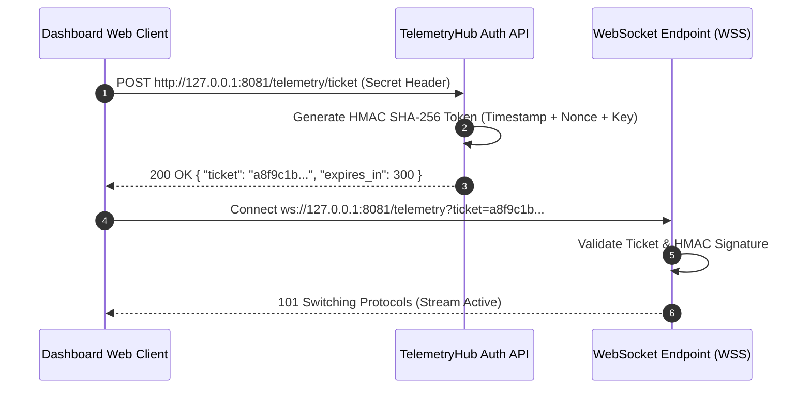

# WebSocket TelemetryHub & HMAC Security (Reference)

This document describes the real-time telemetry streaming service (`TelemetryHub.java`), WebSocket endpoints, JSON event payload structures, and HMAC SHA-256 client authentication flows.

---

## Authentication Ticket Flow

To connect to the live WebSocket telemetry stream (`ws://127.0.0.1:8081/telemetry`), dashboard clients must first request an authenticated ticket token:



---

## WebSocket JSON Telemetry Payload Schema

Events are emitted in JSON format on every step tick:

```json
{
  "event_type": "STATION_STEP_COMPLETED",
  "timestamp": 1722089400123,
  "simulation_tick": 450,
  "station_id": "STATION_3_STAMPING",
  "data": {
    "press_force_kN": 450.2,
    "ductile_damage_NCL": 0.384,
    "die_wear_um": 1.24,
    "microcrack_flag": false,
    "cycle_time_s": 3.8
  },
  "control_mode": "ADACOR"
}
```

---

## Telemetry Stream Categories

| Event Type | Description | Emitting Component | Frequency |
| --- | --- | --- | --- |
| `STATION_STEP_COMPLETED` | Output state updates from station solvers 1-5. | `SimBridgeArtifact.java` | Every tick |
| `HOLON_BID_LOGGED` | Contract-Net proposals and award notifications. | `DatabaseArtifact.java` | On CFP events |
| `CONTROL_MODE_CHANGED` | 2PC regime switch commit notifications (PROSA $\leftrightarrow$ ADACOR). | `supervisor_agent.asl` | On topology switch |
| `AMR_POSITION_UPDATED` | Battery level, grid position, and route milestones. | `amr_agent.asl` | Periodic (5 ticks) |
