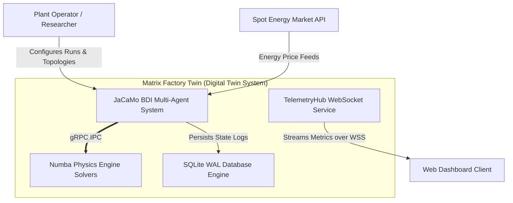

# C4 System Context & Container Model (Explanation)

This document presents the **C4 Architecture Model** for **Matrix Factory Twin**, mapping system boundaries, external software systems, container components, and communication interfaces.

---

## Level 1: System Context Diagram

The System Context diagram illustrates the boundary of Matrix Factory Twin and its interactions with external users, IoT telemetry subscribers, and energy market data feeds.



---

## Level 2: Container Diagram

The Container diagram decomposes the system into executable runtime units and documents their inter-container communication channels.

```mermaid
graph TB
    subgraph Java_Container ["Java JVM - JaCaMo Runtime"]
        MAIN["MainSimulator.java (Clock Coordinator)"]
        AGTS["Jason BDI Agents (Supervisor, Order, Resource, AMR)"]
        ART["CArtAgO Artifacts (Database, Telemetry, SimBridge)"]
    end

    subgraph Python_Container ["Python 3.11 Runtime"]
        DAEMON["daemon_launcher.py (gRPC Server)"]
        NUMBA["Numba JIT ODE Solvers (Stations 1-5)"]
        COOL["CoolProp Fluid EOS"]
    end

    subgraph Data_Container ["Storage & Telemetry"]
        SQLITE[("factory_history.db (SQLite WAL Mode)")]
        WS["WebSocket Telemetry Hub (Port 8081)"]
    end

    MAIN --> AGTS
    AGTS --> ART
    ART ==>|gRPC / Protobuf over mTLS (Port 50051)| DAEMON
    DAEMON --> NUMBA
    NUMBA --> COOL
    ART --> SQLITE
    ART --> WS
```

---

## Container Descriptions & Protocols

| Container | Technology | Responsibilities | Protocols Used |
| --- | --- | --- | --- |
| **Cognitive Agent Container** | Java 17, JaCaMo, Jason BDI | High-level decision making, Contract-Net task allocation, 2PC control regime switching. | In-memory BDI event loop |
| **Physical Solver Container** | Python 3.11, Numba, SciPy, CoolProp | High-fidelity ODE/PDE numerical integration for manufacturing stations 1–5. | gRPC / Protobuf v3 over mTLS |
| **Database Storage Container** | SQLite (WAL Mode) | Asynchronous persistence of station execution events, agent bids, and telemetry logs. | JDBC / CArtAgO async queue |
| **Telemetry Service Container** | Java HTTP/WebSocket server | Live metrics streaming to frontend user dashboards with HMAC SHA-256 token verification. | WSS / JSON Streams |
