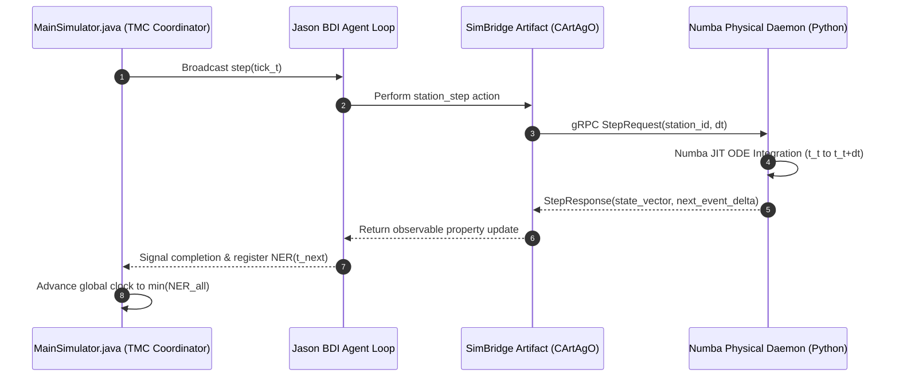

# Time Synchronization Engine (Explanation)

This document explains the deterministic **Next Event Request (NER)** lock-stepped synchronization mechanism implemented in `MainSimulator.java`, eliminating wall-clock dependencies in the co-simulation environment.

---

## The Lock-Stepped Synchronization Problem

Standard digital twin implementations often rely on `Thread.sleep()` or real-time wall-clock pacing to synchronize multi-agent platforms with physical simulation routines. This introduces several major vulnerabilities:

1. **Non-Determinism:** System load fluctuations alter physical solver trajectory outputs across runs.
2. **Race Conditions:** Agent bidding cycles may experience timeout dropouts due to thread scheduling latency.
3. **Reproducibility Failure:** Monte Carlo multi-run batches yield divergent state trajectories under identical seeds.

---

## Next Event Request (NER) Architecture

Matrix Factory Twin resolves this using a **Time Managed Component (TMC)** design pattern driven by `MainSimulator.java`:

---

## Clock Advancement Logic

At each iteration $k$, the global simulation clock $T_k$ advances according to the minimum Next Event Request across all registered active components:

$$T_{k+1} = T_k + \min_{i \in \mathcal{C}} \left( \Delta t_{i, \text{req}} \right)$$

where:
* $\mathcal{C}$ is the set of active physical station models and agent decision loops.
* $\Delta t_{i, \text{req}}$ is the requested time step delta emitted by component $i$.

If a physical station solver encounters a steep stiff gradient (e.g., rapid temperature transition during Station 1 resin curing or Station 5 polarization testing), it requests a micro-step $\Delta t_{\text{fine}}$, causing `MainSimulator.java` to automatically refine global synchronization without losing step lock.
