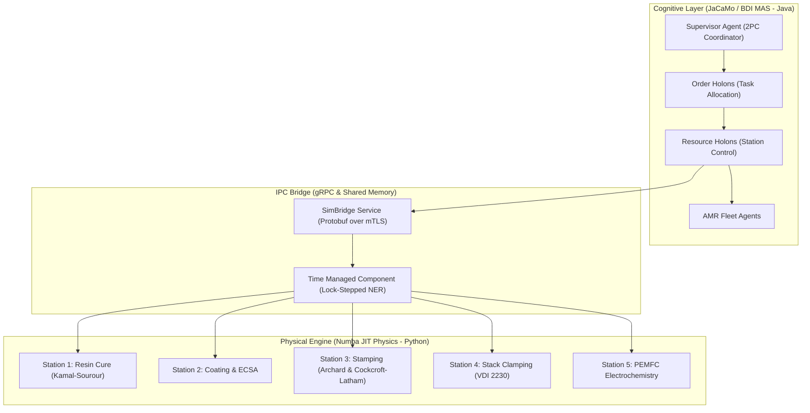

# Matrix Factory Twin — Research Artifacts & Companion Documentation

[](https://zenodo.org/)
[](https://opensource.org/licenses/MIT)
[](https://github.com/utczbr/Matrix_Factory/actions)

Welcome to the companion documentation site for **Matrix Factory Twin**, a hybrid multi-agent digital twin combining BDI cognitive reasoning (JaCaMo/Jason & CArtAgO), Numba JIT-accelerated physical manufacturing models, lock-stepped discrete event synchronization, and dynamic control regime switching.

---

## Executive Abstract

The **Matrix Factory Twin** bridges high-level cognitive decision-making with multi-physics numerical solvers across hydrogen fuel-cell manufacturing lines (PEMFC stack production). By coupling Jason BDI agents operating under holonic control structures (PROSA and ADACOR) with Numba JIT physical solvers via a high-speed gRPC IPC bridge, the twin enables real-time simulation of resin curing, catalyst coating, bipolar plate stamping, stack clamping, and electro-chemical fuel cell testing.



---

## Documentation Structure (Diátaxis Framework)

Our documentation is structured according to the **Diátaxis Documentation Framework**:

1. **Tutorials (Learning-oriented):** Step-by-step onboarding in [Quickstart Guide](getting-started/quickstart.md) and [Architecture Overview](getting-started/architecture-overview.md).
2. **How-To Guides (Goal-oriented):** Operational recipes for [mTLS Security](operations-and-dev/security-mtls.md), [Monte Carlo Scaling](operations-and-dev/monte-carlo-scale.md), and [Testing & Calibration](operations-and-dev/testing-calibration.md).
3. **Reference (Information-oriented):** Mathematical formulations for [Physical Stations](physical-engine/overview.md), [gRPC Protobuf Schemas](api-and-protocols/grpc-protobuf.md), [WebSocket Telemetry](api-and-protocols/websocket-telemetry.md), and [Database Schema](api-and-protocols/database-schema.md).
4. **Explanation (Understanding-oriented):** Deep dives into [C4 System Context](architecture/c4-system-context.md), [Lock-Stepped Time Sync](architecture/time-sync-engine.md), and [PROSA vs. ADACOR 2PC Control Switching](architecture/holonic-control.md).

---

## Artifact Evaluation & Reproducibility

For peer reviewers and researchers verifying manuscript claims:
- **5-Minute Quick Reproducibility:** [Quick Repro Guide](artifact-evaluation/quick-repro.md)
- **Claim-to-Code Traceability:** [Claim Matrix](artifact-evaluation/claim-matrix.md)

---

## Citation

If you use **Matrix Factory Twin** or its physical models in your research, please cite our manuscript:

```bibtex
@article{matrix_factory_twin_2026,
  title     = {Hybrid Multi-Agent Digital Twin for Hydrogen Fuel-Cell Manufacturing},
  author    = {Matrix Factory Research Team},
  journal   = {IEEE Transactions on Industrial Informatics},
  year      = {2026},
  doi       = {10.5281/zenodo.1234567}
}
```
