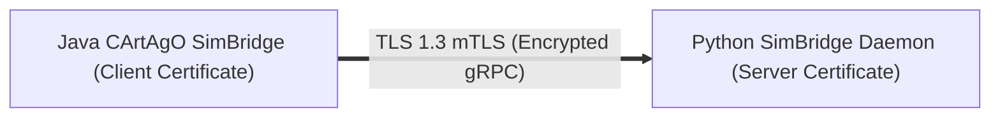

# Security & mTLS Configuration (How-To Guide)

This how-to guide explains how to generate 2048-bit RSA certificates using OpenSSL and enable **mutual TLS (mTLS)** across gRPC channels between the Java JVM and Python physical daemon.

---

## Security Overview

In production or distributed multi-node deployments, the IPC communication between the Java cognitive layer and Python physical solvers must be encrypted and authenticated to prevent unauthorized command injection or state tampering.



---

## Step 1: OpenSSL Certificate Generation

Run OpenSSL commands to generate CA, Server, and Client certificates:

```bash
mkdir -p certs
cd certs

# 1. Generate Root Certificate Authority (CA)
openssl req -x509 -newkey rsa:2048 -nodes -days 3650 \
  -keyout ca-key.pem -out ca-cert.pem \
  -subj "/C=US/ST=State/L=City/O=MatrixFactory/CN=MatrixFactoryRootCA"

# 2. Generate Server Key & CSR (Python Daemon)
openssl req -newkey rsa:2048 -nodes \
  -keyout server-key.pem -out server-req.pem \
  -subj "/C=US/ST=State/L=City/O=MatrixFactory/CN=localhost"

# Sign Server Certificate with Root CA
openssl x509 -req -in server-req.pem -days 365 \
  -CA ca-cert.pem -CAkey ca-key.pem -CAcreateserial \
  -out server-cert.pem

# 3. Generate Client Key & CSR (Java JVM)
openssl req -newkey rsa:2048 -nodes \
  -keyout client-key.pem -out client-req.pem \
  -subj "/C=US/ST=State/L=City/O=MatrixFactory/CN=JavaMASClient"

# Sign Client Certificate with Root CA
openssl x509 -req -in client-req.pem -days 365 \
  -CA ca-cert.pem -CAkey ca-key.pem -CAcreateserial \
  -out client-cert.pem
```

---

## Step 2: Enabling Secure Mode in Python Daemon

Pass the TLS flags when starting the Python physical daemon:

```bash
python3 physical_engine/daemon_launcher.py \
  --port 50051 \
  --secure \
  --ca-cert certs/ca-cert.pem \
  --server-cert certs/server-cert.pem \
  --server-key certs/server-key.pem
```

---

## Step 3: Enabling Secure Mode in Java MAS

Set the security environment variable or system property before executing Gradle:

```bash
export GRPC_SECURE_MODE=true
export GRPC_CA_CERT=certs/ca-cert.pem
export GRPC_CLIENT_CERT=certs/client-cert.pem
export GRPC_CLIENT_KEY=certs/client-key.pem

./gradlew run --args="0 50051 --max-ticks=1000"
```

Verification test suite:
* Test Script: [`physical_engine/factory_simulation/test_grpc_security.py`](https://github.com/utczbr/Matrix_Factory/blob/main/physical_engine/factory_simulation/test_grpc_security.py)
