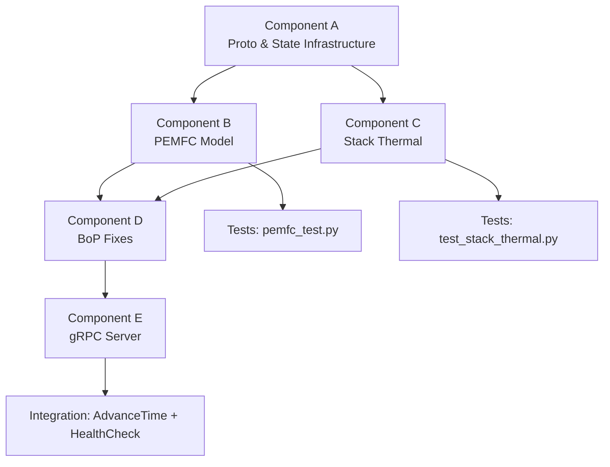

# Phase 1: Physical Layer Validation — Implementation Plan

## Background

This plan covers **Phase 1 only** (per strategic decision #1). The goal is to independently validate the Python physical engine, thermodynamics, and stochastic logic before any JaCaMo/JVM integration. All gRPC scaffolding is included because it serves as the Phase 1 test harness — the server, proto definitions, and daemon launcher are needed to exercise and validate the physics independently.

### Current Codebase State

The existing codebase is a **hydrogen electrolysis plant** simulation with:
- **Core framework**: `Component` ABC, `ComponentRegistry`, `Stream` data flow, `ComponentState` FSM — all well-structured and reusable as-is.
- **Electrolyzer model** (`z=2`, OER/HER, **additive** sign convention) in [pem_electrolyzer.py](file:///home/stuart/Documentos/matrix_factory_twin/components/electrolysis/pem_electrolyzer.py) and [_numba_ops_core_python.py](file:///home/stuart/Documentos/matrix_factory_twin/optimization/_numba_ops_core_python.py) — **deprecated and isolated**.
- **Reusable BoP**: `TankArray`, `CompressorStorage`, `Chiller`, `HeatExchanger`, `LUTManager` — all need targeted fixes.
- **Numba/CoolProp infrastructure**: Working JIT facade in [numba_ops.py](file:///home/stuart/Documentos/matrix_factory_twin/optimization/numba_ops.py), scratchpad pattern already uses `i % numba_threads` (not `get_thread_id()`).

### Strategic Constraints (User-Confirmed)

| # | Constraint | Impact |
|---|-----------|--------|
| 1 | **Phase 1 only** — JaCaMo/JVM/Gradle/ASL/XML deferred to Phase 2 | No Java files, no `.gradle`, no `.asl`, no MoISE XML |
| 2 | **Project root** = `matrix_factory_twin/` (already established) | All new files created under this root |
| 3 | **venv active** with `numpy`, `numba`, `CoolProp` installed | No dependency installation needed |
| 4 | **CoolProp** for Leachman EOS in `CompressorStorage` | Keep CoolProp dependency, narrow exception handling |
| 5 | **Numba defect**: no `cache=True` on kernels using `get_thread_id()` | Existing code already uses `i % numba_threads` ✓ |
| 6 | **Legacy guard**: `pem_electrolyzer.py` deprecated, `z_pemfc != 4` runtime guard | Hard `RuntimeError` in PEMFC constants |

---

## Proposed Changes

The work is organized into 5 components, ordered by dependency (foundations first).

---

### Component A: Proto & State Infrastructure

These files have zero dependencies on existing code and provide the foundation for everything else.

#### [NEW] [sim_bridge.proto](file:///home/stuart/Documentos/matrix_factory_twin/physical_engine/protos/sim_bridge.proto)

Protobuf service definition per doc4 §2 + doc6 §3.1:
- `SimBridge` service with `AdvanceTime`, `RunBatchTest`, `HealthCheck` RPCs
- Messages: `TimeStep` (with `schema_epoch`), `StepReady` (with packed `state_vector`), `BatchTestRequest`, `BatchTestResponse` (with `failure_flags` bitmask)
- `Empty` and `HealthStatus` messages
- All repeated doubles use `[packed = true]`

> [!NOTE]
> The proto is defined now for completeness and to enable the gRPC test harness, but actual gRPC server implementation will compile it using `grpcio-tools`. We'll add `grpcio` and `grpcio-tools` to the venv.

#### [NEW] [proto_index.py](file:///home/stuart/Documentos/matrix_factory_twin/physical_engine/proto_index.py)

`ThermoStateIndex` constant class per doc6 §3.3:
```python
class ThermoStateIndex:
    T_STACK      = 0  # Stack temperature (K)
    P_H2         = 1  # H2 supply pressure (Pa)
    P_O2         = 2  # O2 supply pressure (Pa)
    T_COOLANT    = 3  # Coolant temperature (K)
    M_H2         = 4  # H2 mass in tank (kg)
    V_STACK      = 5  # Stack voltage (V)
    I_STACK      = 6  # Stack current (A)
    T_CORE       = 7  # Stack core temperature (K)
    T_SKIN       = 8  # Stack skin temperature (K)
    _VECTOR_LENGTH = 9
```

#### [NEW] [factory_state.py](file:///home/stuart/Documentos/matrix_factory_twin/physical_engine/factory_simulation/factory_state.py)

Central state manager orchestrating the physics integration loop:
- Pre-allocated state vector: `np.zeros(ThermoStateIndex._VECTOR_LENGTH)`
- Holds component instances: `TankArray`, `CompressorStorage`, `Chiller`, `StackThermalModel`, `PEMFCModel`
- `advance_time(dt)` method that:
  1. Steps tank/compressor physics
  2. Computes PEMFC voltage at current operating point
  3. Computes heat generation → feeds stack thermal model
  4. Stack thermal output → feeds chiller `Q_input`
  5. Populates state vector at `ThermoStateIndex` indices
- Returns populated state vector for embedding in `StepReady`

#### [NEW] [station_stochastics.py](file:///home/stuart/Documentos/matrix_factory_twin/physical_engine/factory_simulation/station_stochastics.py)

Reference constants for Station 1-4 stochastic parameters per doc2 §2:
```python
STATIONS = {
    1: {"name": "MEA Preparation",        "t_mean": 45,  "t_std": 5,  "defect_rate": 0.005},
    2: {"name": "Catalytic Deposition",    "t_mean": 120, "t_std": 15, "defect_rate": 0.012},
    3: {"name": "Bipolar Plate Stamping",  "t_mean": 30,  "t_std": 2,  "defect_rate": 0.002},
    4: {"name": "Robotic Stack Assembly",  "t_mean": 240, "t_std": 30, "defect_rate": 0.008},
}
```
> [!NOTE]
> Actual stochastic sampling occurs on the JVM side (Phase 2). This file provides validation reference constants only.

---

### Component B: PEMFC Electrochemical Model

The core physics model — completely new, isolated from the legacy electrolyzer.

#### [NEW] [pemfc_model.py](file:///home/stuart/Documentos/matrix_factory_twin/physical_engine/factory_simulation/pemfc_model.py)

Complete PEMFC model per doc2 §3 with strict isolation:

**Constants** — `PEMFCConstants` dataclass with `__all__` module isolation:
- `j0_orr = 1e-9` A/cm² (ORR exchange current density)
- `z_pemfc = 4` (4-electron pathway — **NOT** z=2 from electrolyzer)
- `alpha_orr = 0.5`
- `j_lim_pemfc = 2.5` A/cm² (diffusion-limited)
- `B_conc = 0.05`
- Runtime guard: `if PEMFCConstants.z_pemfc != 4: raise RuntimeError(...)` — survives `-O` flag

**Core Functions** (all `@njit(nogil=True, cache=True)`):

1. **`calculate_nernst_potential(T, a_h2, a_o2)`**:
   - $E_{ocv} = 1.229 - 0.85 \times 10^{-3} (T - 298.15) + \frac{RT}{2F} \ln(a_{H_2} \cdot a_{O_2}^{0.5})$
   - Explicit validation: `if not (0.5 <= a_h2 <= 10.0): raise ValueError(...)` (no `assert`)

2. **`calculate_pemfc_voltage(j, T, a_h2, a_o2, R_internal, N_cells)`**:
   - **Subtractive** convention: $V = N_{cells} \times (E_{ocv} - \eta_{act} - \eta_{ohm} - \eta_{conc})$
   - C¹ continuity patch at `j/j_lim > 0.99`:
     - Below 0.99: standard log-based $\eta_{conc}$
     - Above 0.99: linear penalty replacing divergent logarithm
   - Returns individual overpotentials for heat generation calculation

3. **`newton_raphson_solver(V_target, T, a_h2, a_o2, R_internal, N_cells)`**:
   - Analytic Jacobian (closed-form, not finite-difference)
   - `j_safe = max(j, 1e-10)` for activation singularity
   - `np.clip(j_new, 1e-10, 0.999 * j_lim)` bracket
   - `tol = 1e-4`, `max_iter = 50`
   - Returns `SOLVER_DID_NOT_CONVERGE` flag (bit 4 in `failure_flags`) on non-convergence

4. **`batch_polarization_sweep(current_densities, T, a_h2, a_o2, R_internal, N_cells, numba_threads)`**:
   - Vectorized via `numba.prange`
   - Pre-allocated 2D scratchpad: `scratch = np.empty((numba_threads, buffer_size), np.float64)`
   - Thread isolation via `idx = i % numba_threads` (**NOT** `get_thread_id()`)
   - Input validation before loop: `if np.any(current_densities >= j_lim_pemfc): raise ValueError(...)`

#### [NEW] [pemfc_test.py](file:///home/stuart/Documentos/matrix_factory_twin/physical_engine/factory_simulation/pemfc_test.py)

Pytest test suite for empirical convergence verification:

1. **`test_newton_raphson_penalty_region`**: Convergence at `j = 2.49` A/cm² (ratio = 0.996, inside C¹ penalty region) under `tol=1e-4`, `max_iter=50`
2. **`test_nernst_potential_bounds`**: Activity validation raises `ValueError` for out-of-range inputs
3. **`test_subtractive_convention`**: Verify `V_cell < E_ocv` for all `j > 0` (fuel cell convention)
4. **`test_legacy_contamination_guard`**: Verify `RuntimeError` if `z_pemfc != 4`
5. **`test_batch_sweep_consistency`**: Vectorized results match scalar loop
6. **`test_voltage_monotonicity`**: V(j) is monotonically decreasing

> [!IMPORTANT]
> If `test_newton_raphson_penalty_region` fails, we will implement C²-continuous `tanh` smoothing + Armijo backtracking line search as the fallback (doc2 §3.3, doc5 Phase 1).

---

### Component C: Stack Thermal Submodel

#### [NEW] [stack_thermal_model.py](file:///home/stuart/Documentos/matrix_factory_twin/physical_engine/factory_simulation/stack_thermal_model.py)

Per doc2 §4.4 — Yonkist-validated, Hermite H1,1/H0,0 spatial-resolution lumped-capacitance method:

**Yonkist number validation:**
- $Yo = q_{gen} L^2 / (k \cdot \Delta T)$
- Verify $Yo < Bi$ at each timestep (logs warning if violated)

**Dual-temperature model:**
- **Core**: $\frac{dT_{core}}{dt} = \frac{q_{gen} - h_{internal}(T_{core} - T_{skin})}{C_{core}}$
- **Skin**: $\frac{dT_{skin}}{dt} = \frac{h_{internal}(T_{core} - T_{skin}) - h_{ext}(T_{skin} - T_{coolant})}{C_{skin}}$

**Heat generation coupling:**
- Input: ohmic + activation losses from PEMFC: $Q_{gen} = I \times (\eta_{act} + \eta_{ohm})$

**Output:**
- $Q_{output} = h_{ext} \cdot A \cdot (T_{skin} - T_{coolant})$ → feeds `chiller.py`'s `Q_input`

#### [NEW] [test_stack_thermal.py](file:///home/stuart/Documentos/matrix_factory_twin/physical_engine/factory_simulation/test_stack_thermal.py)

- **`test_yonkist_validation`**: Verify Yonkist number computation and Bi comparison
- **`test_steady_state_convergence`**: Run until $|dT/dt| < \epsilon$, verify core > skin > coolant
- **`test_chiller_coupling`**: Verify `Q_output` feeds correctly into chiller

---

### Component D: BoP Component Modifications

Targeted fixes to existing reusable components — minimal, surgical changes.

#### [MODIFY] [h2_tank.py](file:///home/stuart/Documentos/matrix_factory_twin/components/storage/h2_tank.py)

| Change | Rationale |
|--------|-----------|
| Add `self._state_lock = threading.Lock()` to `TankArray.__init__` | Prevent torn reads when Numba `nogil=True` kernels mutate arrays in-place |
| Wrap `fill()`, `discharge()`, `step()` in `with self._state_lock:` | Thread safety per doc2 §4.1 |

#### [MODIFY] [chiller.py](file:///home/stuart/Documentos/matrix_factory_twin/components/thermal/chiller.py)

| Change | Rationale |
|--------|-----------|
| Convert forward Euler to **backward Euler**: `T_new = (T_old + dt*(Q_input + hA*T_amb)/C) / (1 + dt*(hA/C))` | Numerical stability for stiff thermal transients (doc2 §4.3) |
| Add `Q_input` parameter to `ThermalInertiaModel.step()` | Coupling interface from stack thermal submodel |
| Ensure `T_amb` reference is explicit | Decay toward ambient, not absolute zero |

#### [MODIFY] [lut_manager.py](file:///home/stuart/Documentos/matrix_factory_twin/optimization/lut_manager.py)

| Change | Rationale |
|--------|-----------|
| Add `fcntl.flock(LOCK_EX)` to `_generate_lut()` | 30-daemon contention safety (doc2 §4.2) |
| Deduplicate `self.stacked_H = None` declarations in `__init__` | Initialization integrity — found duplicate at ~line 120 and ~line 145 |

#### [MODIFY] [compressor.py](file:///home/stuart/Documentos/matrix_factory_twin/components/compression/compressor.py)

| Change | Rationale |
|--------|-----------|
| Move stage calculations from `initialize()` to `__init__()` | Ensure stage params are set before any `step()` call (doc2 §4.2) |
| Narrow `except Exception` → `except (ValueError, IndexError)` | Prevent silent corrupted state propagation |
| Raise `ComponentInitializationError` on CoolProp failure | Explicit, catchable failure (not silent) |

---

### Component E: gRPC Server & Daemon Infrastructure

The test harness for validating the physics layer independently.

#### [NEW] [server.py](file:///home/stuart/Documentos/matrix_factory_twin/physical_engine/server.py)

gRPC server daemon per doc1 §2.4, doc4 §4:
- `SimBridgeServicer` implementing `AdvanceTime`, `RunBatchTest`, `HealthCheck`
- **Startup sequence**:
  1. Start gRPC port immediately
  2. Background `threading.Thread` runs `warmup_jit_kernels()` (dummy calls to trigger Numba LLVM compilation)
  3. `_is_ready = False` → `True` after warmup completes
  4. `HealthCheck` returns immediate `ready` status
- **Concurrency**:
  - `_physics_step_lock = threading.Lock()` serializes state reads/writes
  - `AdvanceTime`: acquire lock → advance physics → populate state vector → release lock → return `StepReady`
  - `RunBatchTest`: acquire lock → snapshot state → release lock → run solver lock-free → return `BatchTestResponse`
- **Executor**: `ThreadPoolExecutor(max_workers=max(1, os.cpu_count() // 30))`
- **Seeding**: `seed = int.from_bytes(stack_id.encode('utf-8')[:8], 'little') ^ run_id`

#### [NEW] [daemon_launcher.py](file:///home/stuart/Documentos/matrix_factory_twin/physical_engine/daemon_launcher.py)

Monte Carlo fan-out launcher per doc1 §3:
- `multiprocessing.get_context('spawn')` — critical for `NUMBA_NUM_THREADS` injection
- `_daemon_entry(port, n_threads)`: sets `os.environ['NUMBA_NUM_THREADS']` **before** any numba import
- `os.sched_setaffinity()` for CPU pinning
- Ports 50051–50080 for 30 daemons
- Single-daemon mode for Phase 1 testing

---

## Execution Order



## File Manifest (Phase 1)

| Status | File | Component |
|--------|------|-----------|
| NEW | `physical_engine/protos/sim_bridge.proto` | A |
| NEW | `physical_engine/proto_index.py` | A |
| NEW | `physical_engine/factory_simulation/__init__.py` | A |
| NEW | `physical_engine/factory_simulation/factory_state.py` | A |
| NEW | `physical_engine/factory_simulation/station_stochastics.py` | A |
| NEW | `physical_engine/factory_simulation/pemfc_model.py` | B |
| NEW | `physical_engine/factory_simulation/pemfc_test.py` | B |
| NEW | `physical_engine/factory_simulation/stack_thermal_model.py` | C |
| NEW | `physical_engine/factory_simulation/test_stack_thermal.py` | C |
| NEW | `physical_engine/__init__.py` | E |
| NEW | `physical_engine/server.py` | E |
| NEW | `physical_engine/daemon_launcher.py` | E |
| MODIFY | `components/storage/h2_tank.py` | D |
| MODIFY | `components/thermal/chiller.py` | D |
| MODIFY | `optimization/lut_manager.py` | D |
| MODIFY | `components/compression/compressor.py` | D |

**Total: 12 new files + 4 modified files**

---

## Verification Plan

### Automated Tests

```bash
# 1. PEMFC Newton-Raphson convergence at j=2.49 (penalty region)
python -m pytest physical_engine/factory_simulation/pemfc_test.py -v

# 2. Stack thermal submodel Yonkist validation
python -m pytest physical_engine/factory_simulation/test_stack_thermal.py -v

# 3. State vector length validation
python -c "from physical_engine.proto_index import ThermoStateIndex; assert ThermoStateIndex._VECTOR_LENGTH == 9; print('OK')"

# 4. Legacy contamination guard
python -c "
from physical_engine.factory_simulation.pemfc_model import PEMFCConstants
assert PEMFCConstants.z_pemfc == 4
print('PEMFC constants isolated from electrolyzer (z=4, not z=2)')
"

# 5. gRPC server startup + HealthCheck
python physical_engine/server.py &
sleep 3
python -c "
import grpc
from physical_engine.protos import sim_bridge_pb2, sim_bridge_pb2_grpc
ch = grpc.insecure_channel('localhost:50051')
stub = sim_bridge_pb2_grpc.SimBridgeStub(ch)
resp = stub.HealthCheck(sim_bridge_pb2.Empty())
print(f'Server ready: {resp.ready}')
assert resp.ready == True
"
```

### Manual Verification
- Run a full `AdvanceTime` cycle and inspect the 9-element state vector
- Run `RunBatchTest` with 12-point polarization sweep and plot V(j) curve
- Confirm backward Euler chiller produces correct decay toward `T_amb`
- Verify `LUTManager` file locking under concurrent access (spawn 2 processes)

> [!WARNING]
> ### Dependency Note
> Phase 1 requires `grpcio` and `grpcio-tools` in the venv (for proto compilation and server). These will be installed as the first execution step: `pip install grpcio grpcio-tools`.
