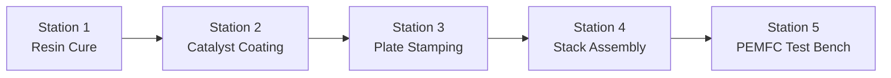

# Physical Engine Architecture (Reference)

This document describes the high-performance physical simulation engine underpinning **Matrix Factory Twin**, detailing its Numba JIT compilation strategy, CoolProp equation-of-state coupling, and gRPC communication layer.

---

## Technical Stack & Acceleration Strategy

The physical engine is implemented in Python 3.11 with Numba JIT acceleration:

* **Numba JIT Compilation (`@njit(fastmath=True)`):** Converts Python numerical ODE/PDE solvers into machine code, achieving 40x–100x execution speeds compared to pure Python loops.
* **CoolProp Integration:** Provides high-accuracy thermodynamic fluid property lookups (density, enthalpy, viscosity) for humidified reactant gases ($H_2$, $O_2$, $N_2$, $H_2O$) in Station 5.
* **gRPC SimBridge IPC Interface:** High-speed binary IPC channel using Protocol Buffers over TLS, allowing low-latency execution step requests from the Java JVM.

---

## Station Model Overview

| Station | Primary Physical Domain | Key Mathematical Models | Accelerated Module |
| --- | --- | --- | --- |
| **Station 1: Resin Cure** | Chemical Kinetics & Thermal | Kamal–Sourour autocatalytic curing, Arrhenius rate constants | `station1_mea_preparation.py` |
| **Station 2: Coating** | Fluid Hydrodynamics & Surface Science | Slot-die capillary coating, solvent evaporation, ECSA degradation | `station2_catalyst_deposition.py` |
| **Station 3: Stamping** | Continuum Mechanics & Damage | Archard tool wear, Normalized Cockcroft–Latham ductile damage ($C_{\text{crit,NCL}}$) | `station3_bipolar_plate_stamping.py` |
| **Station 4: Assembly** | Solid Mechanics & Contact | VDI 2230 bolt torque friction, GDL compression & Bruggeman porosity derating | `station4_stack_clamping.py` |
| **Station 5: PEMFC Test** | Electrochemistry & Transport | Butler–Volmer kinetics, Springer membrane hydration, flooded mass transport $j_{\text{lim}}$ | `pemfc_model.py` |

---

## Inter-Station Quality Degradation Propagation

Physical output states from upstream stations serve as boundary constraints for downstream manufacturing processes:

1. **Station 3 Ductile Micro-Cracks $\rightarrow$ Station 4 Clamping:** Stamping springback and micro-cracks increase local contact stress non-uniformity during clamping.
2. **Station 4 Clamping Pressure $\rightarrow$ Station 5 Polarization:** Interfacial contact pressure $P_{\text{clamp}}$ determines gas diffusion layer (GDL) contact resistance $R_{\text{contact}}$ and bulk porosity $\varepsilon_{\text{gdl}}$.
