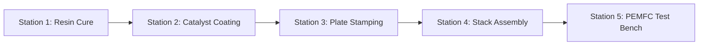

# Physical Engine Overview & Numba Bridge

This document describes the high-performance physical simulation engine underpinning **Matrix Factory Twin**, detailing its Numba JIT compilation strategy, CoolProp equation-of-state coupling, and gRPC communication layer.

---

## Technical Stack & Acceleration Strategy

The physical engine is implemented in Python 3.11 with Numba JIT acceleration:

* **Numba JIT Compilation (`@njit`):** Converts Python numerical ODE/PDE solvers into machine code. Reported speedups are kernel-specific:
    * ~10–100× for general JIT-compiled loops vs. pure Python (`_numba_ops_core_python.py`).
    * ~10–50× for `numba.prange`-parallelized interpolation kernels.
    * ~50–200× specifically for replacing runtime CoolProp calls with the pre-computed LUT layer described below (`optimization/lut_manager.py`).

* **CoolProp Integration:** Provides thermodynamic fluid property lookups via a bilinear-interpolated Lookup Table (LUT) layer (`optimization/lut_manager.py`) that falls back to live CoolProp calls for out-of-bounds queries. `core/constants.py::StandardConditions.CANONICAL_FLUID_ORDER` caches **seven** species: `H2, O2, N2, CO2, CH4, CO, H2O`. Of these, **H₂, O₂, N₂, and H₂O are actively consumed by the Station 5 physics** (humidified reactant activity via `real_gas_activity`).

* **gRPC SimBridge IPC Interface:** High-speed binary IPC channel using Protocol Buffers over TLS, allowing low-latency execution step requests from the Java JVM.

---

## Station Model Overview

| Station | Primary Physical Domain | Key Mathematical Models | Accelerated Module |
| --- | --- | --- | --- |
| **Station 1: Resin Cure** | Chemical Kinetics & Thermal | Kamal–Sourour autocatalytic curing, Arrhenius rate constants | `station1_mea_preparation.py` |
| **Station 2: Coating** | Fluid Hydrodynamics | Slot-die coating deviation model, ECSA degradation | `station2_catalyst_deposition.py` |
| **Station 3: Stamping** | Continuum Mechanics & Damage | Archard tool wear, Normalized Cockcroft–Latham ductile damage ($C_{\text{crit,NCL}}$) | `station3_bipolar_plate_stamping.py` |
| **Station 4: Assembly** | Solid Mechanics & Contact | VDI 2230 bolt torque friction, GDL compression & Bruggeman porosity derating, U-shaped interfacial contact resistance | `station4_stack_clamping.py`, `microstructure.py` |
| **Station 5: PEMFC Test** | Electrochemistry & Transport | Nernst potential, Butler–Volmer kinetics, Springer membrane hydration, flooded mass transport $j_{\text{lim}}$, two-lump thermal model (Yonkist-validated) | `pemfc_model.py`, `membrane_hydration.py`, `stack_thermal_model.py` |

---

## Inter-Station Quality Degradation Propagation

Physical output states from upstream stations serve as boundary constraints for downstream manufacturing processes:

1. **Station 3 Ductile Micro-Cracks → Station 4 Clamping:** Stamping springback and micro-cracks increase local contact stress non-uniformity during clamping.
2. **Station 4 Clamping Pressure → Station 5 Polarization:** Interfacial contact pressure $P_{\text{clamp}}$ determines gas diffusion layer (GDL) contact resistance $R_{\text{contact}}$, GDL bulk resistance $R_{\text{gdl}}$, and bulk porosity $\varepsilon_{\text{gdl}}$, all of which are folded directly into the Station 5 solver's effective internal resistance.

The inter-station coupling mechanism, implemented in `sim_bridge_server.py::RunBatchTest`, evaluates:

$$R_{\text{internal,eff}} = R_{\text{internal},0} + \Delta R_{\text{penalty}} + R_{\text{contact}}\!\left(P_{\text{clamp}}\right)$$

where $R_{\text{internal},0}$ is a per-run baseline (default $0.06\ \Omega\cdot\text{cm}^2$), $\Delta R_{\text{penalty}}$ is an accumulated defect-rate penalty tracked on the Java/agent side, and $R_{\text{contact}}(\cdot)$ is the Station 4 U-shaped contact-resistance model. Reactant activities $a_{H_2}, a_{O_2}$ are separately derated by an `activity_derate_fraction`, and the limiting current $j_{\text{lim}}$ by a `j_lim_derate_fraction`, both also sourced from upstream station outcomes. See the [Station 5 doc](station-5-pemfc.md) for the full path.

> **Implementation note:** $R_{\text{gdl}}$ (GDL bulk electrical resistance via the Bruggeman relation) is specified in the physical submodels but is not wired into `sim_bridge_server.py::RunBatchTest` because `t_comp` is missing from `BatchTestRequest` in `sim_bridge.proto`.

